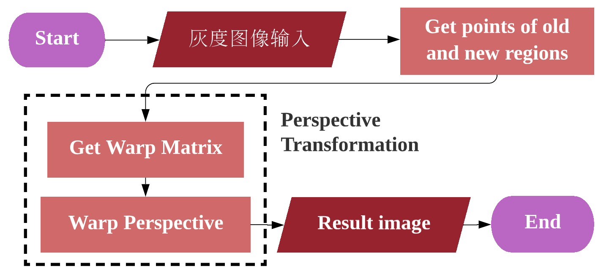
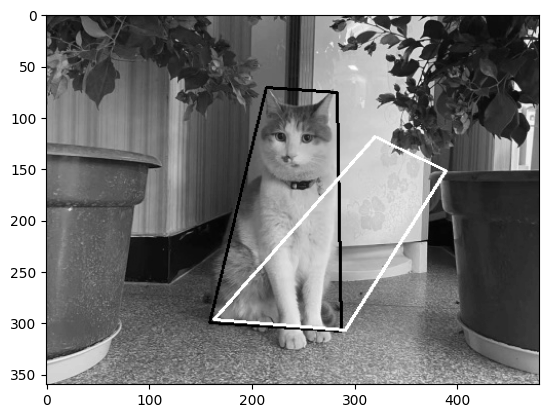
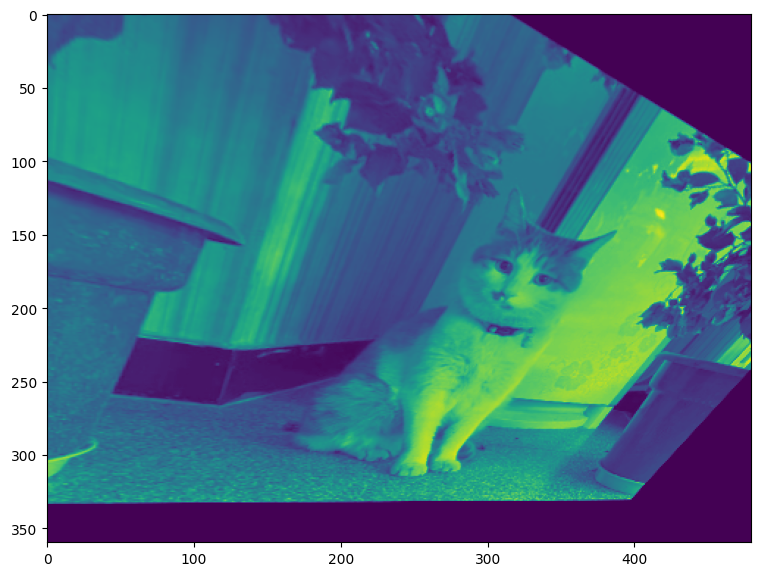
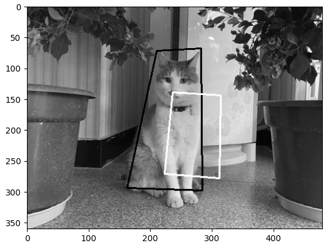
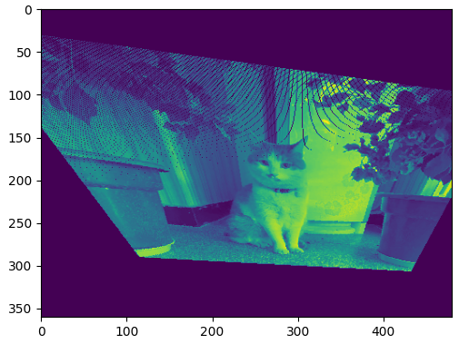
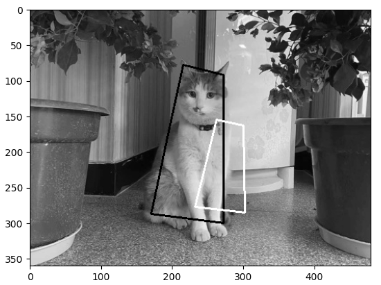
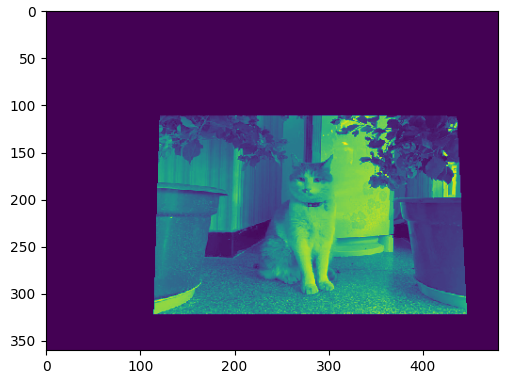

# Perspective-Transformation
 Applying perspective transformation to a grayscale image

$$
\ \ \ \ \ \ \ \ \ \ \ \ \ \ \ \ \ \ \ \ \ \ \ \ \ \ \ \ \ \ \ \ \ \ \ \ \  A \ \ \ \ \ \ \ \ \ \ \ \ \ \ \ \ \ \ \ \ \ \ \ \ \ \ Warp \ Matrix \ \ \ B \\

\begin{bmatrix}
x_0 & y_0 & 1 & 0 & 0 & 0 & -x_0X_0 & -y_0X_0 \\
0 & 0 & 0 & x_0 & y_0 & 1 & -x_0Y_0 & -y_0Y_0 \\
x_1 & y_1 & 1 & 0 & 0 & 0 & -x_1X_1 & -y_1X_1 \\
0 & 0 & 0 & x_1 & y_1 & 1 & -x_1Y_1 & -y_1Y_1 \\
x_2 & y_2 & 1 & 0 & 0 & 0 & -x_2X_2 & -y_2X_2 \\
0 & 0 & 0 & x_2 & y_2 & 1 & -x_2Y_2 & -y_2Y_2 \\
x_3 & y_3 & 1 & 0 & 0 & 0 & -x_3X_3 & -y_3X_3 \\
0 & 0 & 0 & x_3 & y_3 & 1 & -x_3Y_3 & -y_3Y_3 
\end{bmatrix} 

\begin{bmatrix}
a_{11} \\
a_{12} \\
a_{13} \\
a_{21} \\
a_{22} \\
a_{23} \\
a_{31} \\
a_{32} 
\end{bmatrix} 

=

\begin{bmatrix}
X_{0} \\
Y_{0} \\
X_{1} \\
Y_{1} \\
X_{2} \\
Y_{2} \\
X_{3} \\
Y_{3} 
\end{bmatrix}
$$
 

## Algorithm flowchart

| Algorithm flowchart of Perspective Transformation            |
| :------------------------------------------------------------: |
|  |

 

## Result

| Selected Old Region and New Region                           | Perspective Transformation                                   |
| :------------------------------------------------------------: | :------------------------------------------------------------: |
|  |  |
|  |  |
|  |  |

 

